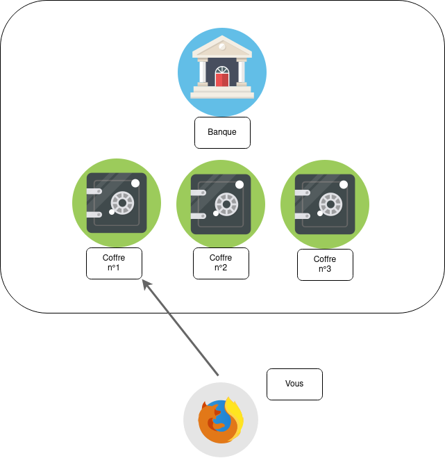

Juste pour m'assurer que ce soit clair pour tout le monde :

---

***Utilisez un gestionnaire de mots de passe, c'est la plus importante chose à faire sur toute votre vie numérique***

---

J'ai écris un [tutoriel](/fiches/bitwarden) pour vous apprendre à utiliser Bitwarden.

***Je vous conseille chaudement de lire [l'article de Wonderfall sur les mots de passe](https://wonderfall.space/password/) après avoir lu le mien, car il va dans la continuité de mon article.***

## Les mots de passe

> **Site web :** Votre mot de passe ne comporte que des lettres !
>
> **Vous :** Faut que je rajoute un caractère spécial en plus ???
>  
> **Site web :** Votre mot est passe est trop court !
>
> **Vous :** Sérieusement ? Bon je vais rajouter un arobase

Cette situation a probablement déjà dû vous arriver, mais pourquoi ces sites web nous embêtent tant ? Et pourquoi je ne peux pas utiliser mon super mot de passe "monchat84" ?

Aujourd'hui, les mots de passe posent beaucoup de problèmes pour beaucoup de monde.
Un mot de passe permet de dire au service auquel vous vous connectez que vous êtes bien celui que vous prétendez être.

Cependant, trop de gens ont tendance à utiliser une application de prise de notes en ligne (tel que OneNote, Google Keep, un fichier Excel dans le Drive, etc.), noter ça sur un post-it, ou pire encore, d'utiliser le même mot de passe sur tous leurs comptes !

Le principe de mettre le même mot de passe partout est peut-être plus facile pour vous, mais ça l'est aussi pour un attaquant ! Si quelqu'un arrivait à vous pirater ou pirater n'importe quel site auquel vous vous êtes connecté, vous perdez tous vos comptes !

> Vous pouvez vérifier si vos identifiants ont été victime d'une fuite en allant sur [haveibeenpwned](https://haveibeenpwned.com/), un compte [twitter](https://twitter.com/haveibeenpwned) est également disponible pour être au courant des dernières failles.

Juste pour que vous comprenez bien le problème d'utiliser le même mot de passe sur tous les comptes, je vais vous faire un exemple :

- Vous vous connectez avec le mot de passe `123456` sur Gmail.
- Puis avec le même mot de passe sur Netflix.
- Puis sur LinkedIn.
- Puis... oooh, grosse faille sur LinkedIn, vos mails et vos mots de passe sont dans la nature.

(LinkedIn est un exemple fictif)

N'importe qui peut se connecter à n'importe lequel de vos comptes, puisque tout le monde a votre adresse mail et votre mot de passe.

Donc utilisez un mot de passe différent pour chaque site.

### Pourquoi un mot de passe doit comporter des majuscules et des caractères spéciaux ?

Tout simplement parce que cela augmente considérablement l'entropie du mot de passe.

> Ah ! Toi aussi tu as vu le film Tenet ?

Pour expliquer simplement, l'entropie est la mesure du désordre.

Plus vous ajoutez des caractères spéciaux, des chiffres et des lettres, plus vous augmentez le désordre, donc par définition son entropie.

Il faut bien comprendre que ce n'est pas une personne qui va deviner un par un les mots de passe, mais des programmes spécialisés pour ça. Ces logiciels se basent sur des dictionnaires et vont agir par attaque par force brute (ou plus communément appelé bruteforce). C'est-à-dire qu'ils vont s'appuyer sur des banques de mot (par thème, par pays, etc.) et vont être concaténés avec les informations fournies par l'attaquant.

Exemple :

Dans une situation un peu plus réelle, l'attaquant va scruter vos réseaux sociaux, comprendre vos goûts, vos habitudes, vos envies, etc. Le hacker utilisera ce fichier comme base, puis y ajoutera certains paramètres à ce programme telles que -liste non-exhaustive- :

- Changement de certains caractères en d'autres (les "a" peuvent être des @ ou des 4, les "e" peuvent être des 3, les "o" peuvent être des 0 (zéro), etc.)

    > Donc oui, `m0t 2 p@ss3` ne vous aidera pas non plus.

- Nombre de caractères possible
- Ajout d'informations personnelles de la victime (par exemple, son prénom, son nom, les noms de son entourage, son âge, le prénom de ses animaux, etc.)

Imaginez que vous avez un chat qui s'appelle Lollipop, que vous êtes né en 1985, que vous adorez monter à cheval et que toutes ces informations soient disponibles sur Internet par l'intermédiaire des réseaux sociaux. Le hacker va télécharger une banque de mots concernant les activités sportives, supprimera les mots superflus, ajoutera 1985 ou 85 dans ses paramètres et aussi le nom de votre chat Lollipop.

Une fois les paramètres ajustés et le logiciel lancé, toutes les combinaisons possibles seront testés (des centaines de milliers, voire millions). Exemple :

- 1985cavalier
- cavalier1985
- cavalier85
- lollipop1985
- lollipop85
- sabot85
- s@bot85
- etc.

Voici un exemple de dictionnaire qu'on appelle aussi communément une **wordlist** (cette liste comporte 1 million de mots) :
[Wordlist française](https://raw.githubusercontent.com/scipag/password-list/main/countries/password-list-fr.txt).

Il est important de noter que même si votre mot de passe ressemble à ça :

> t4@#L"5A

Il peut être deviné (par un ordinateur) en quelques jours seulement, alors que pourtant, le mot de passe contient tout ce que les sites web demandent :

- [x] 8 caractères
- [x] Chiffres
- [x] Majuscules
- [x] Minuscules
- [x] Caractères spéciaux

Le problème que beaucoup de gens et de sites web oublient, c'est que l'entropie du mot de passe ne se joue pas uniquement sur sa complexité, mais également et **surtout** sur [sa longueur](https://bitwarden.com/blog/3-tips-from-nist-to-keep-passwords-secure/).

> Au passage si votre mot de passe fait moins de 8 caractères, c'est cracké en quelques secondes, voir moins d'une seconde.

 Un bon mot de passe est un mot de passe qui est complexe et long. Si votre mot de passe ressemble à ça :

> aaaaaaaaaaaaaaaaaaaaaaaaaaaaaaaaaaaaaaaaaaaaaaaaaaaaaaaaa

C'est super long, mais c'est devinable en moins d'une seconde pour un ordinateur. D'où l'importance de la complexité du mot de passe.

Un bon mot de passe serait quelque chose comme ça :

> @UpXg$atJqQue@x43C8B&matxz4Ed&!C

Mais t'es malade, comment crois-tu que je vais retenir ça ???

En effet, c'est compliqué à retenir. On peut cependant changer ça très simplement en écrivant des phrases et non des mots de passe. Voire mieux, utiliser un gestionnaire de mots de passe.

## Les phrases de passe

---

*L'image vient de [xkcd](https://xkcd.lapin.org/index.php?number=936#strips).*

*Je vous recommande encore une fois [l'article de Wonderfall](https://wonderfall.space/password/) qui explique très bien cette image.*

---

Les phrases de passe sont une excellente manière (pour un humain) de retenir ses mots de passe simplement tout en ayant une entropie élevée.

On a la chance d'être français, car nous possédons beaucoup de caractères spéciaux dans notre langue, tel que justement :

- le ç
- l'apostrophe
- les lettres avec accent (é, è, à, etc.).

Notez aussi que l'**espace** ` ` est un caractère spécial exactement comme le `#` ou le `!`. Écrivez ces phrases dans le champ de mot de passe comme si vous écriviez la phrase en vrai (la majuscule au début, les espaces, le point à la fin et les apostrophes).

Donc une phrase de passe comme...

> J'ai mangé une côte de boeuf à 15 €.

...est parfaitement viable. (N'oubliez quand même pas de rajouter des chiffres). C'est viable, car le mot de passe respecte les conditions :

- [x] 36 caractères
- [x] 2 chiffres (`15`)
- [x] La majuscule (`J`)
- [x] Les minuscules
- [x] Les caractères spéciaux ( l'apostrophe `'`, les espaces ` `, le `é`, le `ô`, le symbole `€` et le point final `.`)

On voit tout de suite que c'est plus facile à retenir qu'un mot de passe de 36 caractères aléatoires.

### La méthode diceware

Cependant, la phrase reste prévisible et est trop personnelle. Une bonne phrase de passe ressemblerait plutôt à ça (aussi appelée [méthode diceware](https://fr.wikipedia.org/wiki/Diceware)) :

> timing paving hertz bacterium pliable angelfish

Qui est également le titre de [l'article de Wonderfall](https://wonderfall.space/password/) que je vous recommande vivement.

Tous ces mots sont générés aléatoirement (par un ordinateur, et non par un humain). Il n'y a pas de majuscules ou de chiffres, mais il possède 6 mots générés **complètement aléatoirement**.

L'avantage de cette méthode est qu'elle nous permet d'avoir des mots de passe longs et complexe mais facile à retenir ! Donc si vous choisissez vous-même vos mots pour créer une phrase de passe, ça ne fonctionnera pas ! Générez-le grâce à Bitwarden par exemple, et ne changez pas les mots !

- Lire les [considérations de la méthode diceware par Wonderfall](https://wonderfall.space/password/#considérations) avant de passer à la suite. (~1 minute de lecture)

> Si vous souhaitez aller un peu plus loin, rajoutez un chiffre quelque part dans la phrase de passe, ou en plein milieu d'un des mots (comme `timing` devient `tim5ing`) et ne changez pas les `a` avec des `@` ou tout autre combine de la sorte, car c'est pris en compte dans les attaques, et donc **complètement** inutile. Vous deviendrez beaucoup plus imprévisible en **rajoutant** un chiffre **au milieu** d'un des mots et/ou un caractère spécial. Mais très franchement, c'est plutôt pour épater la galerie, une phrase de passe de 6 à 8 mots minimum fait largement l'affaire !

Vous pouvez générer des phrases de passe avec [ce site](https://www.rempe.us/diceware/#french) afin de tester un peu. Cependant, c'est mieux de générer votre phrase de passe avec votre gestionnaire de mots de passe. Bitwarden est capable de générer une liste de mots par exemple.

Pour vous donner une idée, un ordinateur personnel est capable de tester quelques millions de mots de passe par seconde.
Vous devez supposer qu'une personne mal intentionné peut aller jusqu'à tester un billion de mots de passe par seconde (soit mille milliards) si il en a les moyens.

La phrase de passe comme montré plus haut, contient 6 mots, et prendrait environ 3500 ans à cracker en testant un billion de mots de passe par seconde. Rajoutez un autre mot comme ceci (pour arriver à 7) :

> timing paving hertz bacterium pliable angelfish massue

Et vous passez à 27 millions d'années de calculs. Cependant, si vous passez de 6 à 5 mots :

> timing paving hertz bacterium pliable

On passe de 3500 ans (pour 6 mots) à 5 mois (pour 5 mots) en testant un billion de mots de passe par seconde.

---

*Ces calculs proviennent du site [diceware](https://www.rempe.us/diceware/#french)*

---

La meilleure solution serait la **phrase de passe** avec des mots aléatoires ([méthode diceware](#la-méthode-diceware)) ou des **mots de passe** d'une vingtaine de caractères ***minimum***, couplés avec un gestionnaire de mots de passe.

> Bitwarden propose la génération d'une phrase de passe composé de 3 mots par défaut séparé par un `-`, je vous conseille de le paramétrer à 6 mots. Vous pouvez aussi, si vous le souhaitez, changer le séparateur par un espace (plus facile à retenir et à écrire), activer les majuscules au début de chaque mot et ajouter un chiffre.

Un humain retiendra de toute façon plus facilement une liste de mots aléatoirement choisie qu'une suite de caractères incompréhensibles.

Le minimum requis serait [6 mots](https://wonderfall.space/password/#calculs-dentropie) à mon avis. **Avec un espace ou n'importe quel autre caractère spécial comme séparateur**

*Si un site web n'accepte pas plus d'une vingtaine de caractères, vous serez incapable de faire plus de 3 mots. Je vous conseille de générer un mot de passe aléatoire du nombre de caractères maximum autorisé du site web. En aparté, un site web n'acceptant pas plus de 20 caractères pour un mot de passe, ça en dit long sur la sécurité qu'ils appliquent sur leurs services...*

## Les gestionnaires de mots de passe

Même en utilisant des phrases de passe, il vous reste un problème majeur : il faut avoir un mot de passe différent par site web.
Et c'est compliqué, voire impossible de tous les retenir.

Plusieurs solutions s'offrent à vous :

1. La solution papier : écrire sur un post-it ou sur un carnet.
2. L'écrire dans une application de prise de notes de type OneNote, Google Keep, ou dans un fichier Excel.
3. Utiliser un gestionnaire de mots de passe.

### La solution papier

Le problème d'écrire sur un post-it ou dans un carnet est que n'importe qui peut juste l'ouvrir et lire vos mots de passe et mail. Vous allez vous dire que vous avez juste à écrire votre mail de cette façon :

> sam-----@--.com

Mais ça ne vous aidera pas non plus. Beaucoup de gens utilisent le même mail pour tous leurs comptes également, donc cacher son mail n'est pas très utile. Surtout que c'est une info qui peut être retrouvée facilement sur Internet.
Si vous commencez à vous dire que vous pouvez toujours décaler les caractères de vos mots de passe (par exemple `a` devient `b` ou `1` devient `2`), ou que vous omettez un caractère que vous ajoutez manuellement pendant la connexion du site, permettez-moi de vous dire que vous vous prenez la tête pour très peu de sécurité et de commodité. (De plus, je veux pas casser l'ambiance, mais le [chiffre de César](https://fr.wikipedia.org/wiki/Chiffrement_par_d%C3%A9calage), ça fait 2000 ans que l'on sait le décrypter.)

### Les applications de prise de notes

Mettre votre mot de passe sur une application comme Google Keep ou OneNote est une aberration pour plusieurs raisons :

La première est que ces applications ne sont pas faites pour enregistrer des identifiants. Vos données sont dans le cloud et votre fournisseur **voit** ces données en clair (Google, ou Microsoft (OneDrive), etc.). Comme ce n'est pas chiffré, si un hacker compromet un des serveurs, il aura accès à tous vos mots de passe.

La deuxième, c'est que ces applications de prises de notes proposent rarement un système de verrouillage (comme un code PIN par exemple), vous y accédez directement en ouvrant juste l'application. Si vous utilisez OneNote sur le téléphone par exemple, une fois connecté, vous restez connecté. Donc si vous laissez votre smartphone à quelqu'un ou que vous le laisser ouvert sur une table en soirée, une personne peut accéder à votre téléphone et voler vos mots de passe. Ne minimisez pas le fait qu'il y ai peu de chances que ça arrive, c'est une menace réelle.

La troisième, c'est que ces services ne sont pas du tout fait pour ça. Vous vous connectez plusieurs fois par jour sur vos comptes, c'est pas du tout pratique d'ouvrir votre application de prise de notes, chercher votre service souhaité dans vos notes désorganisées puis de les copier 😵.

### Les gestionnaires de mots de passe

Les gestionnaires de mots de passe sont souvent sous forme d'extension sur votre navigateur (Firefox, Google Chrome, Brave, Safari), vous cliquez sur l'extension puis cliquez sur l'identifiant et ça remplit automatiquement les champs de connexion !

Si vous ne faites pas confiance aux gestionnaires de mots de passe parce que ça revient à dire que vous mettez tous vos oeufs dans le même panier. Le problème est exactement le même en utilisant une application de prise de notes ou en utilisant le même mot de passe partout. Et puis pourquoi faire confiance à OneNote ou Google Keep si vous ne faites pas confiance aux gestionnaires de mots de passe ?

La différence est qu'un gestionnaire de mots de passe est fait pour ça, il implémente du [chiffrement de bout en bout](/basiques/instant-messengers/#le-chiffrement-de-bout-en-bout), et **vous seul** uniquement, avez accès à vos identifiants. Ni le gestionnaire de mots de passe ni un hacker pourrait accéder vos identifiants, puisque tout est chiffré et que vous seul avez la clé.

Les gestionnaires de mots de passe sont fait pour être simple d'utilisation, vous cliquez sur un bouton, et il vous remplira automatiquement es champs de connexion. Vous pouvez générer des mots de passe complexes, rajoutez des notes à vos identifiants, ajoutez vos carte bancaires, etc. Vous pouvez également installer Bitwarden sur votre PC (ou MacBook), sur votre smartphone (ou iPhone), et si vous êtes en sortie, que vous n'avez ni votre PC et ni votre smartphone, vous pouvez directement accéder sur un navigateur !
Je sais que Bitwarden le propose, vous pouvez vous y rendre via [vault.bitwarden.com](https://vault.bitwarden.com).

Les gestionnaires de mots de passe sont sécurisés, et super pratiques ! Donc utilisez-les !

### Quel gestionnaire utiliser ?

**[Bitwarden](https://bitwarden.com/)** : c'est gratuit, c'est open source, c'est simple d'utilisation.

[Proton Pass](https://proton.me/fr/pass) est également une solution, mais sa version gratuite offre moins de possibilités que la version gratuite de Bitwarden. De plus, Proton Pass est nouveau sur le marché. À suivre de près donc.

> *Je rappelle qu'aucun produit n'est affilié, je choisis les solutions selon leurs mérites. J'utilise Bitwarden tous les jours, car à ma connaissance, c'est le seul gestionnaire de mots de passe open source qui propose autant de simplicité et de fonctionnalités.*

### Fonctionnement

Vous vous créez un compte sur **Bitwarden** par exemple.
Vous créez un *mot de passe maître* (également appelé *master password* en anglais) avec 6 mots aléatoires comme ceci :

> os lino nantit corder tapi vingt

Une fois votre mot de passe maître créé, vous pouvez ajouter vos identifiants de tous vos comptes.

Un gestionnaire de mots de passe est basiquement une liste de vos mots de passe, chiffré, dont vous êtes le seul à y avoir accès.

> Je vais ici réitérer ce que j'ai dit dans mon [article](/basiques/threat-model/#protéger-votre-vie-privée-des-fournisseurs-de-services) sur la [modélisation des menaces](/basiques/threat-model).

*Je vais simplifier énormément les faits évidemment, mais ça permettra que vous compreniez de quoi je parle.*

Vous avez un coffre à la banque, ce coffre est le numéro 1, les autres coffres sont à d'autres clients de la banque.

Le problème étant que si c'est la banque qui gère votre clé, elle peut ouvrir votre coffre à n'importe quel moment. De plus, si des braqueurs entrent dans la banque, ils n'ont qu'à voler les clés, et ouvrir les coffres de tout le monde !

Pour ce faire, la banque va vous donner une clé, vous serez le seul à avoir cette clé et personne d'autre. Quand vous irez à la banque pour ouvrir votre coffre, vous pourrez l'ouvrir grâce à l'unique clé que vous détenez.

C'est exactement le même principe avec les gestionnaires de mots de passe.

Votre banque est le gestionnaire de mots de passe, et les coffres sont les bases de données chiffrées des personnes.

> Une base de données est une liste d'informations, ici, ce sont des identifiants de connexion. Mais vous pouvez imaginer ça comme une feuille Excel par exemple.

Quand vous vous connectez à **Bitwarden** par exemple, vous donnez votre mail et votre `mot de passe maître` et cela permet d'identifier à qui appartient telle base de données.

Bitwarden vous envoie votre base de données sur votre navigateur (toujours en chiffré) et tout sera déchiffré localement au niveau de votre navigateur (grâce à votre mot de passe).

Si vous souhaitez en savoir plus je vous conseille d'aller voir ces liens, tous en anglais :

- [How password managers work - Computerphile](https://www.youtube-nocookie.com/embed/w68BBPDAWr8) (Vidéo YouTube)
- [How to choose a password - Computerphile](https://www.youtube-nocookie.com/embed/3NjQ9b3pgIg) (Vidéo YouTube)
- [Bitwarden Docs - Vault Data](https://bitwarden.com/help/vault-data/)
- [Bitwarden Docs - What encryption is used](https://bitwarden.com/help/what-encryption-is-used/)
- [Page Cryptographique Interactive par Bitwarden](https://bitwarden.com/crypto.html)

## Les bonnes pratiques

Une fois inscrit sur votre gestionnaire de mots de passe favori, certaines bonnes pratiques sont à prendre en compte :

1. Cela va de soit, n'écrivez pas votre `mot de passe maître` sur OneNote. Gardez votre mot de passe soigneusement dans un coin de votre tête, si vous utilisez la [méthode diceware](#la-méthode-diceware), vous allez le retenir très rapidement !
2. Si vous vous connectez sur l'interface web comme [vault.bitwarden.com](https://vault.bitwarden.com) ou n'importe quel autre gestionnaire de mots de passe accessible en ligne. Pensez à ouvrir un ***nouvel onglet privé***, car une fois que vous fermerez cette fenêtre, vous serez déconnecté de l'appareil. Au pire des cas, la version web de Bitwarden vous déconnecte automatiquement au bout de 15 minutes, vous pouvez raccourcir ce temps dans les paramètres de votre compte (je conseille 5 minutes maximum).
3. Créez un mot de passe unique (une vingtaine de caractères aléatoires grand minimum) sur chaque site web que vous visitez.
4. Ne donnez sous **aucun prétexte** votre `mot de passe maître` à qui que ce soit !

## Conclusion

---

La **première** règle du mot de passe est :

- **Ne réutilisez pas vos mots de passe.**

La **deuxième** règle du mot de passe est :

- ***Ne réutilisez pas vos mots de passe.***

La **troisième** règle du mot de passe est :

- ***Le plus long possible, 32 à 64 caractères minimum et complètement aléatoire.***

La **quatrième** règle et la plus importante :

- ***Ne donnez SOUS AUCUN PRÉTEXTE votre mot de passe maître à qui que ce soit !***

---

Gardez bien ces quatres règles en tête :

- **Un compte = un mot de passe**
- Utilisez un gestionnaire de mots de passe. [Bitwarden](https://bitwarden.com/) est excellent. Je vous ai même fait [un tuto](/fiches/bitwarden) parce que je suis sympa.
- Si vous devez retenir vos mots de passe, utilisez [la méthode diceware](#la-méthode-diceware) comme évoquée plus haut (6 mots minimum). (Et créez quelque chose d'aléatoire, ne le faites pas vous-même.) Si besoin, ajoutez une majuscule ou un chiffre. Bitwarden a cette [option dans son générateur](/fiches/bitwarden/#le-générateur-de-mots-de-passe).
- Sinon, créez des mots de passe aléatoires de 32, voire 64 caractères, parce que de toute façon, vous n'aurez pas besoin de les retenir, et vous pourrez les copier/coller. (Le grand minimum est de 20 caractères de nos jours.)

*Je me répète, je sais, mais on pourra pas dire que je l'ai pas dit !* 😁

---

## En savoir plus & crédits

- 🇬🇧️ [How password managers work - Computerphile](https://www.youtube-nocookie.com/embed/w68BBPDAWr8) (Vidéo YouTube)
- 🇬🇧️ [How to choose a password - Computerphile](https://www.youtube-nocookie.com/embed/3NjQ9b3pgIg) (Vidéo YouTube)
- 🇫🇷️ [timing paving hertz bacterium pliable angelfish - Wonderfall](https://wonderfall.space/password/)
- [Les alternatives 📚️ # Les gestionnaires de mots de passe - SimplePrivacy](/alternatives/apps/#les-gestionnaires-de-mots-de-passe)
- 🇬🇧️ [The quest for a family-friendly password manager - Julien Voisin](https://dustri.org/b/the-quest-for-a-family-friendly-password-manager.html)
- 🇫🇷️ [Recommandations relatives à l'authentification multifacteur et aux mots de passe - ANSSI](https://cyber.gouv.fr/publications/recommandations-relatives-lauthentification-multifacteur-et-aux-mots-de-passe)
- 🇫🇷 [Cyberattaques : Mots de passe toujours épargnés ? Démos ludiques et explications ! - Adrien Linuxtricks](https://www.youtube-nocookie.com/embed/hndVWRt5XR0)
