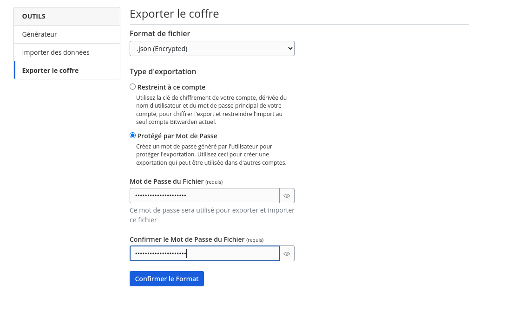
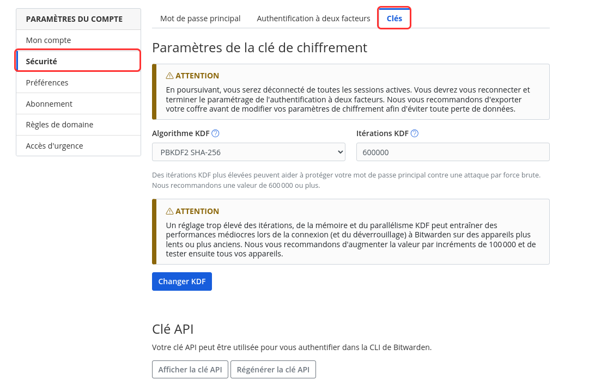

Si vous avez créé votre compte Bitwarden avant Février 2023, le changement des clés (à ne pas confondre avec votre mot de passe) est ***très fortement*** recommandé !!!

Connectez-vous sur le [web vault](https://vault.bitwarden.com/) de Bitwarden.

## Exportation de votre coffre

Pour éviter qu'un drame se produise, nous allons en premier lieu exporter votre base de données (c'est à dire vos mots de passe).

Sur le web vault (ou "coffre web" en bon français) :

- Cliquez sur votre **Outils > Exporter le coffre**

- Dans le menu déroulant, choisissez `".json (Encrypted)"` puis sélectionnez `"Protégé par mot de passe"`, rentrez le mot de passe que vous souhaitez, mais notez-le temporairement juste le temps de faire la [Modification de la clé](#modification-de-la-clé) dans le chapitre suivant. On chiffre le base de données pour éviter qu'elle soit téléchargé en clair sur le disque, car même supprimé, on pourrait retrouver l’entièreté de vos mot de passe.

- Cliquez sur "**Confirmer le Format**", rentrez votre mot de passe maître (votre mot de passe Bitwarden) quand la fenêtre s’ouvrira puis confirmez l'exportation.

## Modification de la clé

Maintenant que vous avez exporter votre base de données, vous pouvez changer la clé de chiffrement de Bitwarden.

- Cliquez sur votre "**Profil > Paramètres du compte**"

- Naviguez dans "**Sécurité > Clés**"

- Dans le menu déroulant "**Algorithme KDF**", sélectionnez "**Argon2id**", laissez les valeurs par défaut

- Cliquez sur "**Changer KDF**", cette action vous déconnectera de toutes vos sessions.
- Après reconnexion, vérifiez que vos identifiants sont bien présents (et que les mails et les mots de passe sont corrects).
- **Supprimez** la base de données que vous avez exporter au chapitre précédent.
