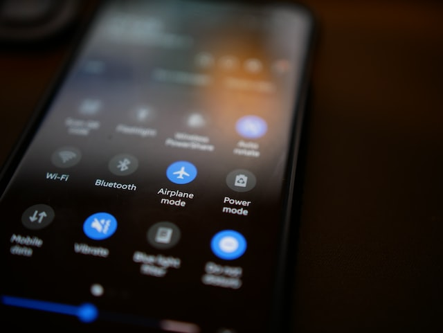

Tout le monde a accès à Internet à la maison, mais certaines configurations sont à faire si vous souhaitez sécuriser votre réseau chez vous.

Mes recommandations sont divisées en deux parties :

La **première** partie sera consacrée à des configurations que je considère obligatoire et simples à mettre en place.

La **deuxième** partie sera tant qu'à elle, consacrée à des configurations intermédiaires, qui sont simples à mettre en place, mais optionnelles (même si fortement recommandés).

*On va essentiellement paramétrer votre box (Freebox, Livebox, SFR Box, etc.).*

> Petit rappel de notion : Le Wi-Fi n'est qu'un **moyen de communication** pour accéder à Internet, ce n'est pas Internet. Vous pouvez connecter deux téléphones entre eux pour partager des fichiers en Wi-Fi, de la même manière que le Bluetooth. Le Bluetooth peut également vous permettre d'accéder à Internet.

## Première partie

### Connexion à la box

Accédez à votre box, pour cela, connectez-vous en Wi-Fi chez vous, ça ne fonctionnera pas en utilisant le réseau mobile.
Pour y accéder, ouvrez un navigateur et tapez l'adresse IP de votre box dans la barre d'URL, c'est en général [192.168.1.1](http://192.168.1.1) ou [192.168.1.254](http://192.168.1.254).

> Vous aurez probablement une erreur comme quoi le site n'est pas sécurisé, car il est en HTTP. Vous pouvez y aller sereinement, ce site est local, c'est à dire qu'il n'est visible que par les personnes qui ont accès à votre réseau local (ceux qui ont le mot de passe de votre Wi-Fi).

Dans le cas où ce n'est aucune de ces IP, je vous laisse une liste d'aide vers les documentations officielles des FAI principaux (Fournisseur d'Accès à Internet) :

- [Orange - Livebox](https://assistance.orange.fr/livebox-modem/toutes-les-livebox-et-modems/installer-et-utiliser/piloter-et-parametrer-votre-materiel/l-interface-de-configuration/livebox-play-acceder-a-l-interface-de-configuration-_19428-19631)
- [Free - Freebox](https://assistance.free.fr/articles/freebox-os-acceder-a-freebox-os-depuis-mon-domicile-468)
- [SFR - Box SFR (NB4, NB6, etc.)](https://assistance.sfr.fr/internet-tel-fixe/box-nb4/configurer-acces-interface-web-administration.html)
- [Bouygues - Bbox](https://www.assistance.bouyguestelecom.fr/s/article/connexion-installation-interface-administration-bbox)

### Changer le mot de passe de l'interface web

La toute première chose à faire est de changer le mot de passe par défaut de cette interface web (souvent appelé mot de passe administrateur).
[Générez](/fiches/bitwarden/#le-générateur-de-mots-de-passe) un mot de passe aléatoire avec [Bitwarden](/fiches/bitwarden/).

### Changer la clé Wi-Fi

Générez une phrase de passe aléatoire pour la Wi-Fi, d'au moins 8 mots si la box l'autorise, ne descendez pas en dessous de 6.

> Je vous conseille de créer une phrase de passe plutôt qu'un mot de passe, car si vous devez l'écrire manuellement (comme sur une smart TV par exemple), ce sera beaucoup plus simple d'écrire quelques mots plutôt qu'une trentaine de caractères aléatoires 😉️.

### Désactiver le WPS

Il est important de désactiver le [WPS](https://fr.wikipedia.org/wiki/Wi-Fi_Protected_Setup), car celui-ci possède des [failles de sécurité](https://sviehb.files.wordpress.com/2011/12/viehboeck_wps.pdf) connues depuis 2011. C'est une technologie qui permet de se connecter plus facilement au réseau Wi-Fi, cependant très peu de monde l'utilise réellement, vous avez donc une faille de sécurité activée par défaut sur toutes les box (car oui, WPS est activé par défaut, ne me demandez pas pourquoi...).

### Utiliser WPA2 ou WPA3

WEP, WPA2 et WPA3 sont les protocoles de chiffrement des réseaux Wi-Fi.
[Arrêtez tout de suite](http://www.isaac.cs.berkeley.edu/isaac/mobicom.pdf) d'utiliser le WEP, c'est un protocole fondamentalement pas sécurisé. J'ai personnellement réussi à cracker une clé WEP (sur ma propre box, rassurez-vous) en moins de 3 minutes, et en prenant mon temps ! Un [logiciel](https://www.kali.org/tools/wifite/) gratuit et open-source le fait même pour vous en 3 clics.

> Je ne vous encourage pas à [enfreindre la loi](https://www.legifrance.gouv.fr/jorf/id/JORFTEXT000000875419), cela va de soi.

Choisissez WPA2 ou WPA3 selon si votre box offre le WPA3 ou non.
Si votre box vous offre la possibilité de faire soit du "WPA2" ou du "WPA2/WPA3", je vous conseille de choisir WPA2/WPA3. Si votre box vous propose WPA3 uniquement, choisissez de préférence cette option.

> Très précisément, il faudra choisir "WPA2 AES" ou "WPA3 AES" si la box vous offre plusieurs options.

Le "WPA2/WPA3" permet aux nouvelles machines compatibles de se connecter au WPA3, mais garantit la compatibilité des vieux modèles en utilisant le WPA2 (c'est à dire que les deux protocoles sont utilisés). Cela agrandit sérieusement la [surface d'attaque](https://fr.wikipedia.org/wiki/Surface_d'attaque), choisissez donc WPA2 dans cette situation.

### Mettez à jour votre box

Mettez à jour votre box, c'est très important, ces mises à jour fixent souvent des vulnérabilités !
Certaines box font les mises à jour automatiquement, dans ce cas, vous n'avez rien à faire, et d'autres ont besoin d'un redémarrage. Dans le doute, je vous conseille quand même de redémarrer votre box une fois par mois.

- [Mise à jour - Livebox](https://assistance.orange.fr/livebox-modem/toutes-les-livebox-et-modems/installer-et-utiliser/piloter-et-parametrer-votre-materiel/l-interface-de-configuration/livebox-2-les-mises-a-jour-du-logiciel-interne-firmware-_179070-726029)
- Mise à jour - Freebox - redémarrer la box une fois par mois.
- [Mise à jour - SFR Box](https://assistance.sfr.fr/television/box-thd/realiser-maj-box-thd-sfr.html)
- [Mise à jour - Bbox](https://www.assistance.bouyguestelecom.fr/s/forum/question/0D5080000BUP0PzCQL/mettre-%C3%A0-jour-ma-bbox)

## Deuxième partie

### Créer un réseau Wi-Fi invité

Afin de cloisonner votre réseau personnel de vos invités, je vous conseille de créer un réseau Wi-Fi invité qui va permettre aux personnes d'accéder à Internet sans accéder à votre réseau local (vos ordinateurs, vos consoles de jeux, votre [NAS](https://fr.wikipedia.org/wiki/Serveur_de_stockage_en_r%C3%A9seau), etc...). En général, ce sera la même Wi-Fi affiché, mais la clé Wi-Fi sera différente si vous vous connectez avec votre clé ou la clé invitée.

### Changer le nom du SSID

Le [SSID](https://fr.wikipedia.org/wiki/Service_set_identifier) est tout simplement le nom de votre réseau Wi-Fi. Je vous conseille de changer le nom, car il donne souvent le type de box que vous avez ! Cela reviendrait à afficher en bas de votre immeuble quel type de porte/serrure vous utilisez. Vous pouvez lui donner le nom que vous voulez, évitez juste des mots trop évocateurs de votre vie personnelle (tel que votre nom, prénom, âge, métiers, etc.).
